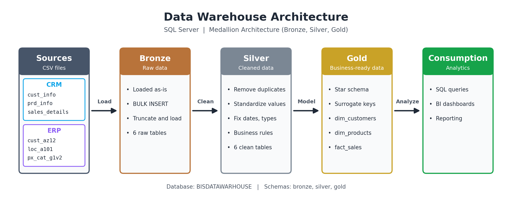

# SQL Server Data Warehouse (Medallion Architecture)

A data warehouse built with **SQL Server** that combines data from two source systems (**CRM** and **ERP**) into a clean, analytics-ready **star schema**, using the **Bronze, Silver, Gold** layered approach.

## Architecture



| Layer | Purpose | What happens here |
|---|---|---|
| **Bronze** | Raw data | CSV files loaded as-is with `BULK INSERT` (truncate and load) |
| **Silver** | Cleaned data | Cleansing, standardization, deduplication, and type fixes |
| **Gold** | Business-ready data | Views forming a star schema: 2 dimensions and 1 fact table |

All three layers live in one database, `BISDATAWARHOUSE`, as separate schemas: `bronze`, `silver`, and `gold`.

## Data Sources

| System | Table | Content |
|---|---|---|
| CRM | `crm_cust_info` | Customer information |
| CRM | `crm_prd_info` | Product information |
| CRM | `crm_sales_details` | Sales transactions |
| ERP | `erp_cust_az12` | Customer birthdate and gender |
| ERP | `erp_loc_a101` | Customer country |
| ERP | `erp_px_cat_g1v2` | Product categories |

## Silver Layer: Data Cleansing

- **Customers**: removed duplicates by keeping the latest record per customer, trimmed names, and converted codes to readable values (`S` to single, `M` to married, `F` to Female, `M` to Male). Missing values become `n/a`.
- **Products**: split the product key into a category ID and a product key, replaced missing costs with 0, converted product line codes (Mountain, Road, Touring, Other Sales), and calculated each product's end date from the next version's start date.
- **Sales**: converted integer dates (`YYYYMMDD`) to real `DATE` values, set invalid dates to `NULL`, and recalculated sales and price when values were missing, negative, or inconsistent with `quantity * price`.
- **ERP customers**: removed the `NAS` prefix from customer IDs, set future birthdates to `NULL`, and standardized gender values.
- **ERP locations**: standardized country names (for example `DE` to Germany, `US` and `USA` to United States).

## Gold Layer: Star Schema

| View | Type | Description |
|---|---|---|
| `gold.dim_customers` | Dimension | Customers from CRM, enriched with country and birthdate from ERP. Gender comes from CRM, with ERP as a fallback. |
| `gold.dim_products` | Dimension | Current products with category, subcategory, cost, and product line. |
| `gold.fact_sales` | Fact | Sales transactions linked to the two dimensions through surrogate keys. |

## Project Files

| File | Purpose |
|---|---|
| `01_init_database.sql` | Creates the database and the `bronze`, `silver`, and `gold` schemas |
| `02_bronze_create_tables.sql` | Creates the Bronze tables |
| `03_bronze_load_data.sql` | Loads the CSV files into the Bronze tables |
| `04_silver_create_tables_and_load.sql` | Creates the Silver tables and loads all of them in one script |
| `05_silver_load_crm_cust_info.sql` | Silver load for CRM customers |
| `06_silver_load_crm_prd_info.sql` | Silver load for CRM products |
| `07_silver_load_crm_sales_details.sql` | Silver load for CRM sales |
| `08_silver_load_erp_px_cat_g1v2.sql` | Silver load for ERP product categories |
| `09_silver_load_erp_loc_a101.sql` | Silver load for ERP locations |
| `10_silver_load_erp_cust_az12.sql` | Silver load for ERP customers |
| `11_gold_create_views.sql` | Creates the Gold views (star schema) |

## How to Run

1. Run `01_init_database.sql` to create the database and schemas.
2. Run `02_bronze_create_tables.sql` to create the Bronze tables.
3. Open `03_bronze_load_data.sql`, **change the CSV paths** (currently `E:\DWHproject\datasets\...`) to match your machine, then run it.
4. Run `04_silver_create_tables_and_load.sql` to create and fill the Silver tables. Scripts `05` to `10` contain the same loads, one table per file, if you prefer to run them separately after creating the tables.
5. Run `11_gold_create_views.sql` to create the Gold views.
6. Query the Gold layer, for example:
   ```sql
   SELECT TOP 10 * FROM gold.fact_sales;
   ```

## Tech Stack

- SQL Server (T-SQL)
- SQL Server Management Studio (SSMS)
- Medallion architecture and star schema modeling

## Author

**zyadbhlol**: [GitHub](https://github.com/zyadbhlol)
